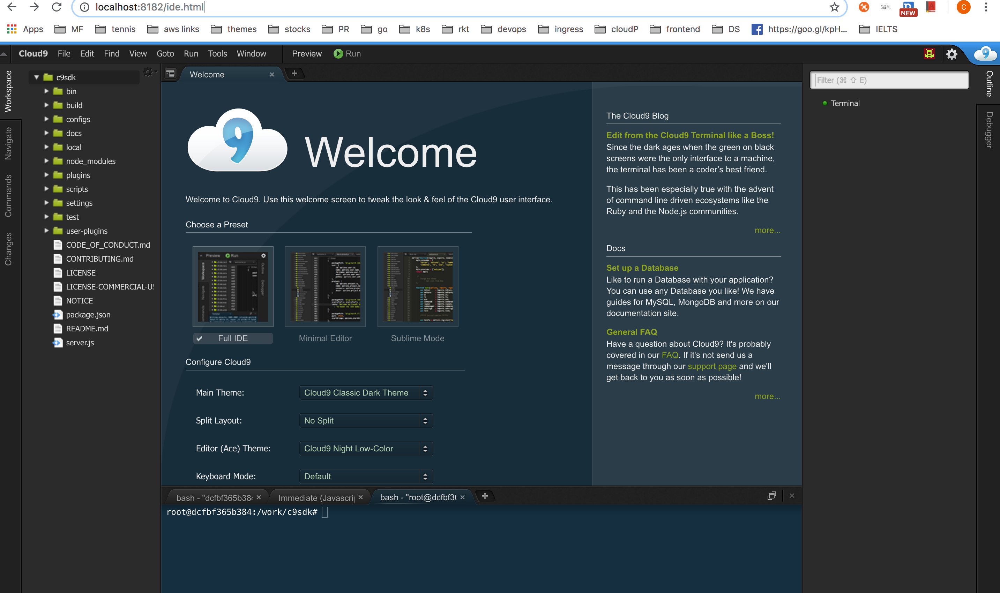

# docker for cloud9 ide
It's ubuntu based cloud9 ide. To run

```bash
$ docker run -td  -p <local-port>:8182 techtaste/dock-c9
```

open : http://localhost:8182/ide.html



### Example
```
$ docker run -td  -p 8182:8182 techtaste/dock-c9
```
<br/>

### Custome path
Pass env "C9_PATH" value to change working directory(WD). Default WD="/work/c9sdk")
```bash
$ docker run -td  -p 8182:8182 -e C9_PATH=<path> techtaste/dock-c9
```
### Example
```
$ docker run -td  -p 8182:8182 -e C9_PATH=/ techtaste/dock-c9
```

### Reference
Cloud9 Core - https://c9.github.io/core/ https://c9.io

### Have fun !!
